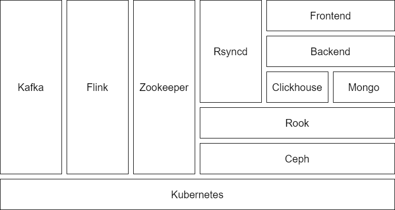

# 云计算环境部署文档

## 集群信息

### 基本信息

本次云计算作业的实验集群一共包含 3 个节点，每个节点的硬件规格如下：

|CPU|Mem|Disk|
| ---------| ------| -------------------------------------|
|16 Core|64Gi|512G（312G for OS + 200G for Ceph）|

三个节点共同组成了一个 K8s 集群，版本为 1.28，采用 1 master (also serve as worker) + 2 worker 的架构，集群中部署了完成云计算实验所需的全部应用。集群进行环境部署配置的全部脚本和配置文件都位于 [Github 仓库](https://github.com/NJU-2023Postgraduate-DepMining/cluster-deploy)当中。

### 服务概览

​​

|服务|IP|DNS 域名|备注|
| ------------------| --------------------------------------| ------------------------------------------------------------------------------| -------|
|MySQL|172.29.4.74:30007<br />|mysql.mysql:3306|-|
|Redis|172.29.4.74:30005|redis.redis:6379|-|
|MongoDB|172.29.4.74:30004|mongo-db.default:27017|-|
|MongoDB_Express|172.29.4.74:30008|-|WebUI|
|Kafka_Broker|-|kafka.kafka:9094|-|
|Kafka_Controller|-|kafka.kafka:9093|-|
|Zookeeper|-|zookeeper.zookeeper:2181<br />zookeeper.zookeeper:2888<br />zookeeper.zookeeper:3888|-|
|Ceph|-|-|-|
|Flink|-|flink-standalone-cluster.default:6123<br />flink-standalone-cluster.default:6124|-|
|Flink_WebUI|172.29.4.74:30002|-|WebUI|
|Clickhouse|172.29.4.74:30012<br />172.29.4.74:30013|clickhouse.clickhouse:8123<br />clickhouse.clickhouse:9000|-|
|Rsync_server|172.29.4.74:30015|rsync-server.default:873|-|
|Backend|172.29.4.74:30017|cloud-computing-backend.cloud-computing:8080|-|
|Frontend|172.29.4.74:30018|-||

## 环境的部署

### 操作系统配置

集群的三个节点均安装有 Ubuntu Server 20.04 LTS 作为操作系统，操作系统安装完成之后需要执行`server-init/server-init.sh`​脚本完成操作系统的基本配置。该脚本主要完成以下工作：

* 移除 Snap 服务
* 安装基础工具`net-tools`​和`vim`​
* 禁用 Swap

### 部署 K8s

在部署 K8s 之前需要在每个节点上都安装 Containerd，具体的命令如下：

```bash
# step 1: 安装必要的一些系统工具
sudo apt-get update
sudo apt-get -y install apt-transport-https ca-certificates curl software-properties-common
# step 2: 安装GPG证书
curl -fsSL https://mirrors.aliyun.com/docker-ce/linux/ubuntu/gpg | sudo apt-key add -
# Step 3: 写入软件源信息
sudo add-apt-repository "deb [arch=amd64] https://mirrors.aliyun.com/docker-ce/linux/ubuntu $(lsb_release -cs) stable"
# Step 4: 更新并安装Docker-CE
sudo apt-get -y update
sudo apt-get -y install containerd.io
```

接下来在 Master 节点上执行脚本`k8s-cluster/master-install.sh`​，脚本执行成功之后会在终端输出形式类似如下的内容：

```plaintext
kubeadm join 192.168.152.3:6443 --token 3qtruy.vq5sadrdseq38w01 \
        --discovery-token-ca-cert-hash sha256:268a0d2073856dab164a008e3b437446cdf0134a259379f679a29815edf50848
```

将这个片段复制下来在另外的两个 Worker 节点上执行即可完成 K8s 的部署，之后通过如下的命令部署集群容器网络插件：

```bash
kubectl apply -f k8s-cluster/kube-flannel.yaml
```

之后部署 Kubernetes Dashboard：

```bash
kubectl apply -f app/kubernetes-dashboard
```

### 安装 Helm

使用如下命令安装 Helm：

```bash
wget https://get.helm.sh/helm-v3.13.2-linux-amd64.tar.gz
tar -zxvf helm-v3.13.2-linux-amd64.tar.gz
mv linux-amd64/helm /usr/local/bin/helm
```

### 部署 Rook

Rook 是在 Kubernetes 中部署 Ceph 所需要的工具，本处通过 Helm 安装 Rook，Values 配置文件为`app/rook-ceph/values-cluster.yaml`​和`aapp/rook-ceph/values-prod.yaml`​，安装命令如下：

```bash
helm repo add rook-release https://charts.rook.io/release
helm repo update
helm install --namespace rook-ceph rook-ceph rook-release/rook-ceph --create-namespace --version v1.12.2 -f values-prod.yaml
helm install --namespace rook-ceph rook-ceph-cluster rook-release/rook-ceph-cluster --version v1.12.2 -f values-cluster.yaml
```

安装完成之后需要额外配置外界访问 Dashboard 的 Service，命令如下：

```bash
kubectl -n rook-ceph apply -f dashboard-svc.yaml
```

### 部署 Flink

使用如下命令部署 Flink Operator：

```bash
kubectl create -f app/flink/cert-manager.yaml
helm repo add flink-operator-repo https://downloads.apache.org/flink/flink-kubernetes-operator-1.4.0/
helm install flink-kubernetes-operator flink-operator-repo/flink-kubernetes-operator
```

接下来通过以下的文件创建 Flink 集群（1 JobManager + 2 TaskManager）：

```bash
kubectl apply -f app/flink/flink-cluster.yaml
kubectl apply -f app/flink/flink-cluster-svc.yaml
```

### 部署其他应用

使用如下的命令部署应用：

```bash
kubectl apply -f app/stor-share/pvc.yaml
kubectl apply -f app/stor-share/rsyncd.yaml
kubectl create ns kafka
kubectl apply -f app/kafka
kubectl create ns mongo
kubectl apply -f app/mongo
kubectl create ns clickhouse
kubectl apply -f app/clickhouse
kubectl create ns zookeeper
kubectl apply -f app/zookeeper
```

> 以上应用部署完成之后，需要修改`default`​名空间下的名为`flink-standalone-cluster-taskmanager`​的 Deployment，修改后的片段如下：
>
> ```yaml
>         volumeMounts:
>         - mountPath: /opt/flink/conf
>           name: flink-config-volume
>         - mountPath: /pool
>           name: data-pool
> ```
>
> ```yaml
>       volumes:
>       - configMap:
>           defaultMode: 420
>           items:
>           - key: log4j-console.properties
>             path: log4j-console.properties
>           - key: flink-conf.yaml
>             path: flink-conf.yaml
>           name: flink-config-flink-standalone-cluster
>         name: flink-config-volume
>       - name: data-pool
>         persistentVolumeClaim:
>           claimName: stor-share
> ```

> 应用数据集需要通过 Rsync 上传至服务器，供 Flink 应用读取，上传的命令为：
>
> ```bash
> rsync -av --bwlimit=20000 <local_file> rsync://user@172.29.4.74:30015/volume
> ```

### 部署前后端应用

使用如下命令部署前端和后端应用：

```bash
kubectl create ns cloud-computing
kubectl apply -f app/cloud-computing/frontend.yaml
kubectl apply -f app/cloud-computing/backend.yaml
```

‍
